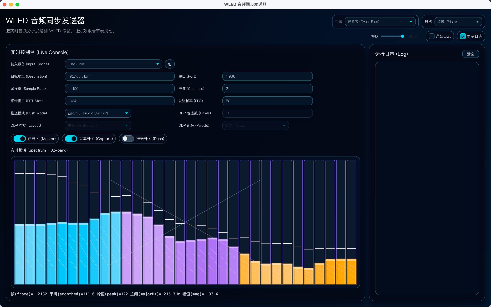
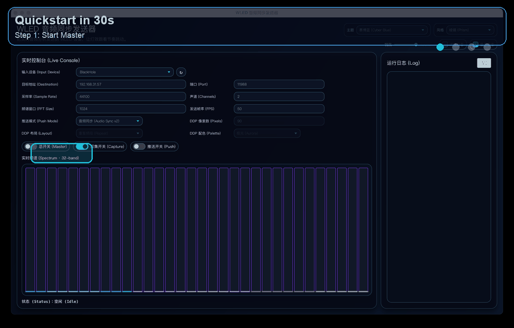

# WLED 音频同步发送器（JavaFX）

把 macOS 的系统音频（例如 BlackHole）实时分析后发送给 WLED，支持两种输出：

- **Audio Sync v2**（WLED 音频同步协议）
- **DDP RGB**（像素推送）

目标是“开箱可用”：下载代码 -> 编译 -> 启动 GUI -> 打开开关即可看到灯效联动。

## 界面预览



## 30 秒上手



## 功能亮点

- JavaFX GUI，参数可视化配置（输入设备、目标地址、模式、FPS、FFT 等）
- 支持 `audio-sync` / `ddp` 双模式切换
- DDP 支持 3 种布局：`stretch` / `repeat` / `mirror`
- DDP 支持 5 套配色：`aurora` / `sunset` / `fire` / `ocean` / `candy`
- 运行中可实时切换 DDP 布局和配色（DDP 模式下立即生效）
- 推送开关关闭时会真正断开发送 socket，开启时重连
- 推送失败带重试退避（避免高频狂刷重连日志）
- 右侧日志面板支持一键“清空”

## 运行环境

- macOS（已按 macOS 音频路由流程验证）
- JDK 17+（推荐 21）
- Maven 3.8+
- WLED 设备（建议同一局域网）

## 快速开始（3 步）

### 1) 配置 WLED

1. `Config` -> `WiFi Setup` -> 打开 `Disable WiFi sleep`
2. 如果用 Audio Sync：`Config` -> `Sync Interfaces` -> `Audio Sync = Receive`，端口 `11988`
3. 如果用 DDP：`Config` -> `Sync Interfaces` -> 打开 `DDP RGB (network)`，端口 `4048`
4. 修改同步设置后建议重启一次 WLED

### 2) 配置 macOS 音频路由（系统声音 -> BlackHole）

1. 打开 `Audio MIDI Setup`
2. 新建 `Multi-Output Device`
3. 勾选真实输出（耳机/扬声器）+ `BlackHole 2ch`
4. 在系统声音输出中选择这个多输出设备

### 3) 编译并启动

```bash
# 查看本机 JDK
/usr/libexec/java_home -V

# 编译
JAVA_HOME=$(/usr/libexec/java_home -v 21) mvn -q -DskipTests compile

# 启动 GUI
JAVA_HOME=$(/usr/libexec/java_home -v 21) mvn -q -Djavafx.args="" javafx:run
```

## 默认值（当前代码）

- `--dest` 默认：`192.168.31.57`
- `--mode` 默认：`audio-sync`
- 端口默认：`11988`（Audio Sync）/ `4048`（DDP）
- `--ddp-pixels` 默认：`90`
- `--ddp-layout` 默认：`repeat`
- `--ddp-palette` 默认：`aurora`
- `--fps` 默认：`50`
- GUI 初始开关：`Master=关`、`Capture=开`、`Push=关`

> 注意：`192.168.31.57` 是示例局域网地址，实际使用请改成你自己的 WLED IP。

## 常用启动示例

```bash
# 列出可用输入设备（CLI 输出）
JAVA_HOME=$(/usr/libexec/java_home -v 21) mvn -q -Dexec.mainClass=local.wled.app.WledAudioSyncSender -Dexec.args="--list-devices" exec:java

# Audio Sync（单播到某个 WLED）
JAVA_HOME=$(/usr/libexec/java_home -v 21) mvn -q -Djavafx.args="--input BlackHole --dest 192.168.31.57 --port 11988" javafx:run

# DDP 像素推送
JAVA_HOME=$(/usr/libexec/java_home -v 21) mvn -q -Djavafx.args="--mode ddp --dest 192.168.31.57 --ddp-pixels 150 --ddp-layout repeat --ddp-palette aurora --port 4048" javafx:run
```

如果你希望 Dock 显示固定应用名（而不是 `java`），可用：

```bash
./scripts/build-and-open-macos-app.sh
```

## 参数说明

- `--input`：输入设备关键字（默认 `BlackHole`）
- `--dest`：目标 IP（默认 `192.168.31.57`）
- `--mode`：`audio-sync` 或 `ddp`（默认 `audio-sync`）
- `--port`：目标端口（`audio-sync=11988`, `ddp=4048`）
- `--ddp-pixels`：DDP 像素数（默认 `90`，范围 `1~4096`）
- `--ddp-layout`：`stretch` / `repeat` / `mirror`
- `--ddp-palette`：`aurora` / `sunset` / `fire` / `ocean` / `candy`
- `--rate`：采样率（默认 `44100`）
- `--channels`：声道数（默认 `2`，仅支持 `1/2`）
- `--fft`：FFT 点数（默认 `1024`，必须为 2 的幂）
- `--fps`：发送帧率（默认 `50`）
- `--verbose`：开启详细日志

## DDP 说明

### 布局

- `stretch`：16 频段拉伸到整条灯带，过渡平滑
- `repeat`：16 频段重复铺开，节奏感强
- `mirror`：左右镜像，适合中点扩散视觉

### 配色

- `aurora`：青绿到暖色，均衡通用
- `sunset`：暖金橙红，氛围柔和
- `fire`：红橙高饱和，冲击强
- `ocean`：蓝青冷色，更安静
- `candy`：粉紫霓虹，风格化明显

## GUI 使用提示

- 点击 `Master` 启动/停止发送主流程
- `Capture` 控制是否采集音频，`Push` 控制是否发 UDP
- 运行中切换 DDP 布局/配色会实时生效
- 日志区域右上角 `清空` 可快速清掉历史日志

## 常见问题

### 1) 灯完全不动

- 确认 WLED 的同步模式已打开且端口正确
- 确认 macOS 输出走的是多输出设备（含 BlackHole）
- 确认输入设备选的是 BlackHole（输入，不是输出）

### 2) 推送开启后卡顿或不稳定

- 优先使用单播（`--dest <wled-ip>`）
- DDP 先把像素数降到 `60~120`，FPS 降到 `20~30` 做基线
- WLED 打开 `Disable WiFi sleep`

### 3) 日志里出现 Host is down / 推送失败

- 检查目标 IP 是否正确、设备是否在线
- 程序会自动退避重试；网络恢复后会自动恢复发送

## 开发备注

- 使用 Maven 标准结构（`src/main/java`, `src/main/resources`, `src/test/java`）
- 当前以 JavaFX GUI 为主入口
- Audio Sync v2 数据包为 44 字节小端结构，header `00002`
